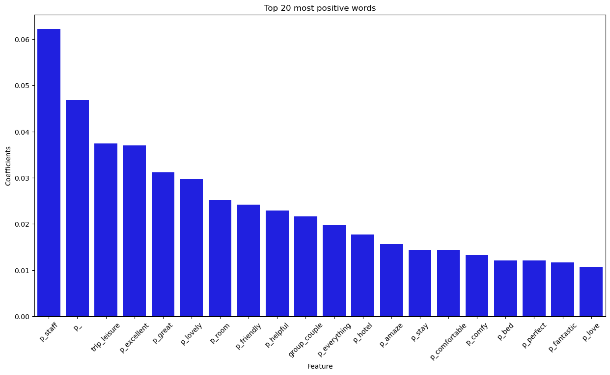
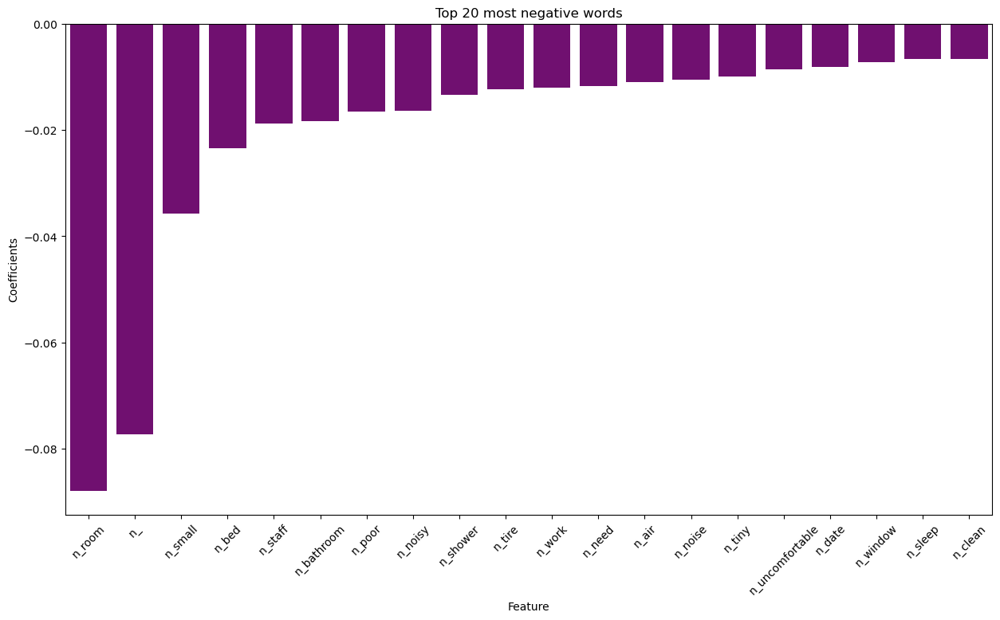

##### Imports:
------


```python
import warnings
warnings.filterwarnings('ignore')

#Importing the packages we will be using
# Basic Packages
import numpy as np
import pandas as pd
import matplotlib.pyplot as plt

import seaborn as sns
import re
import string

# SK Packages
from sklearn.linear_model import LogisticRegression
from sklearn.metrics import accuracy_score
from sklearn.model_selection import train_test_split


#Modelling
from sklearn.decomposition import PCA
#%%time

```

##### Loading the data:


```python
test = pd.read_csv('clean_test_dataframe.csv') #Loading the test data
train_full = pd.read_csv('clean_train_dataframe.csv') #
```


```python
train_full.shape
```


    (12798, 2744)


```python
train_full.isna().sum() #Checking number of null values in all of the columns.
```


    Additional_Number_of_Scoring         0
    Average_Score                        0
    Review_Total_Negative_Word_Counts    0
    Total_Number_of_Reviews              0
    Review_Total_Positive_Word_Counts    0
                                        ..
    n_year                               0
    n_yes                                0
    n_yet                                0
    n_young                              0
    rating                               0
    Length: 2744, dtype: int64


- No null values in the dataframe


```python
train_full.head() # checking first 5 rows of data
```


<div>
<style scoped>
    .dataframe tbody tr th:only-of-type {
        vertical-align: middle;
    }

    .dataframe tbody tr th {
        vertical-align: top;
    }

    .dataframe thead th {
        text-align: right;
    }
</style>
<table border="1" class="dataframe">
  <thead>
    <tr style="text-align: right;">
      <th></th>
      <th>Additional_Number_of_Scoring</th>
      <th>Average_Score</th>
      <th>Review_Total_Negative_Word_Counts</th>
      <th>Total_Number_of_Reviews</th>
      <th>Review_Total_Positive_Word_Counts</th>
      <th>Total_Number_of_Reviews_Reviewer_Has_Given</th>
      <th>days_since_review</th>
      <th>lat</th>
      <th>lng</th>
      <th>weekday_of_review</th>
      <th>...</th>
      <th>n_worry</th>
      <th>n_worth</th>
      <th>n_would</th>
      <th>n_write</th>
      <th>n_wrong</th>
      <th>n_year</th>
      <th>n_yes</th>
      <th>n_yet</th>
      <th>n_young</th>
      <th>rating</th>
    </tr>
  </thead>
  <tbody>
    <tr>
      <th>0</th>
      <td>620</td>
      <td>9.0</td>
      <td>0</td>
      <td>1974</td>
      <td>164</td>
      <td>1</td>
      <td>562</td>
      <td>51.506558</td>
      <td>-0.004514</td>
      <td>1</td>
      <td>...</td>
      <td>0</td>
      <td>0</td>
      <td>0</td>
      <td>0</td>
      <td>0</td>
      <td>0</td>
      <td>0</td>
      <td>0</td>
      <td>0</td>
      <td>1</td>
    </tr>
    <tr>
      <th>1</th>
      <td>1258</td>
      <td>9.4</td>
      <td>6</td>
      <td>4204</td>
      <td>4</td>
      <td>5</td>
      <td>276</td>
      <td>51.502435</td>
      <td>-0.000250</td>
      <td>0</td>
      <td>...</td>
      <td>0</td>
      <td>0</td>
      <td>0</td>
      <td>0</td>
      <td>0</td>
      <td>0</td>
      <td>0</td>
      <td>0</td>
      <td>0</td>
      <td>1</td>
    </tr>
    <tr>
      <th>2</th>
      <td>995</td>
      <td>8.1</td>
      <td>2</td>
      <td>3826</td>
      <td>38</td>
      <td>1</td>
      <td>129</td>
      <td>51.504348</td>
      <td>-0.033444</td>
      <td>0</td>
      <td>...</td>
      <td>0</td>
      <td>0</td>
      <td>0</td>
      <td>0</td>
      <td>0</td>
      <td>0</td>
      <td>0</td>
      <td>0</td>
      <td>0</td>
      <td>1</td>
    </tr>
    <tr>
      <th>3</th>
      <td>853</td>
      <td>8.4</td>
      <td>7</td>
      <td>2726</td>
      <td>10</td>
      <td>10</td>
      <td>164</td>
      <td>51.507377</td>
      <td>0.038657</td>
      <td>0</td>
      <td>...</td>
      <td>0</td>
      <td>0</td>
      <td>0</td>
      <td>0</td>
      <td>0</td>
      <td>0</td>
      <td>0</td>
      <td>0</td>
      <td>0</td>
      <td>0</td>
    </tr>
    <tr>
      <th>4</th>
      <td>1243</td>
      <td>8.1</td>
      <td>11</td>
      <td>6608</td>
      <td>8</td>
      <td>69</td>
      <td>639</td>
      <td>51.513556</td>
      <td>-0.180002</td>
      <td>1</td>
      <td>...</td>
      <td>0</td>
      <td>0</td>
      <td>0</td>
      <td>0</td>
      <td>0</td>
      <td>0</td>
      <td>0</td>
      <td>0</td>
      <td>0</td>
      <td>0</td>
    </tr>
  </tbody>
</table>
<p>5 rows × 2744 columns</p>
</div>


```python
train_full.tail() # checking last 5 rows of data
```


<div>
<style scoped>
    .dataframe tbody tr th:only-of-type {
        vertical-align: middle;
    }

    .dataframe tbody tr th {
        vertical-align: top;
    }

    .dataframe thead th {
        text-align: right;
    }
</style>
<table border="1" class="dataframe">
  <thead>
    <tr style="text-align: right;">
      <th></th>
      <th>Additional_Number_of_Scoring</th>
      <th>Average_Score</th>
      <th>Review_Total_Negative_Word_Counts</th>
      <th>Total_Number_of_Reviews</th>
      <th>Review_Total_Positive_Word_Counts</th>
      <th>Total_Number_of_Reviews_Reviewer_Has_Given</th>
      <th>days_since_review</th>
      <th>lat</th>
      <th>lng</th>
      <th>weekday_of_review</th>
      <th>...</th>
      <th>n_worry</th>
      <th>n_worth</th>
      <th>n_would</th>
      <th>n_write</th>
      <th>n_wrong</th>
      <th>n_year</th>
      <th>n_yes</th>
      <th>n_yet</th>
      <th>n_young</th>
      <th>rating</th>
    </tr>
  </thead>
  <tbody>
    <tr>
      <th>12793</th>
      <td>68</td>
      <td>7.8</td>
      <td>2</td>
      <td>264</td>
      <td>20</td>
      <td>2</td>
      <td>185</td>
      <td>51.522087</td>
      <td>-0.108244</td>
      <td>0</td>
      <td>...</td>
      <td>0</td>
      <td>0</td>
      <td>0</td>
      <td>0</td>
      <td>0</td>
      <td>0</td>
      <td>0</td>
      <td>0</td>
      <td>0</td>
      <td>0</td>
    </tr>
    <tr>
      <th>12794</th>
      <td>1172</td>
      <td>7.8</td>
      <td>10</td>
      <td>5945</td>
      <td>8</td>
      <td>16</td>
      <td>627</td>
      <td>51.499981</td>
      <td>-0.192879</td>
      <td>6</td>
      <td>...</td>
      <td>0</td>
      <td>0</td>
      <td>0</td>
      <td>0</td>
      <td>0</td>
      <td>0</td>
      <td>0</td>
      <td>0</td>
      <td>0</td>
      <td>0</td>
    </tr>
    <tr>
      <th>12795</th>
      <td>562</td>
      <td>8.5</td>
      <td>0</td>
      <td>1944</td>
      <td>26</td>
      <td>5</td>
      <td>702</td>
      <td>51.492418</td>
      <td>-0.278470</td>
      <td>1</td>
      <td>...</td>
      <td>0</td>
      <td>0</td>
      <td>0</td>
      <td>0</td>
      <td>0</td>
      <td>0</td>
      <td>0</td>
      <td>0</td>
      <td>0</td>
      <td>1</td>
    </tr>
    <tr>
      <th>12796</th>
      <td>154</td>
      <td>8.0</td>
      <td>13</td>
      <td>768</td>
      <td>6</td>
      <td>2</td>
      <td>24</td>
      <td>51.512676</td>
      <td>-0.186783</td>
      <td>0</td>
      <td>...</td>
      <td>0</td>
      <td>0</td>
      <td>0</td>
      <td>0</td>
      <td>0</td>
      <td>0</td>
      <td>0</td>
      <td>0</td>
      <td>0</td>
      <td>0</td>
    </tr>
    <tr>
      <th>12797</th>
      <td>390</td>
      <td>7.8</td>
      <td>7</td>
      <td>1717</td>
      <td>9</td>
      <td>2</td>
      <td>526</td>
      <td>51.492627</td>
      <td>-0.228860</td>
      <td>2</td>
      <td>...</td>
      <td>0</td>
      <td>0</td>
      <td>0</td>
      <td>0</td>
      <td>0</td>
      <td>0</td>
      <td>0</td>
      <td>0</td>
      <td>0</td>
      <td>1</td>
    </tr>
  </tbody>
</table>
<p>5 rows × 2744 columns</p>
</div>


df.head()/tail() show that all columns have appropriate entries.


```python
train_full.dtypes #checking datatypes of columns
```


    Additional_Number_of_Scoring           int64
    Average_Score                        float64
    Review_Total_Negative_Word_Counts      int64
    Total_Number_of_Reviews                int64
    Review_Total_Positive_Word_Counts      int64
                                          ...   
    n_year                                 int64
    n_yes                                  int64
    n_yet                                  int64
    n_young                                int64
    rating                                 int64
    Length: 2744, dtype: object


All columns are numerical which are appropriate datatypes for modelling.

##### Splitting the data:

Both the test and train data come in separate csvs so they will be split separately. 


```python
# Split test data into X and Y:
X_test = test.drop(columns='rating')
y_test = test['rating']

```


```python
X_test.shape #Shape of X variable.
```


    (4267, 2743)


```python
y_test.shape #Shape of y variable.
```


    (4267,)


```python
# Split train data into X and Y:
X_train_full = train_full.drop(columns='rating')
y_train_full = train_full['rating']
```


```python
X_train_full.shape #Shape of X variable.
```


    (12798, 2743)


```python
y_train_full.shape #Shape of y variable.
```


    (12798,)


##### Splitting training data: Train and Validation set:

The remainder data will be split into train and validation sets.


```python
# Splitting the remainder in two chunks: train and validation set.
X_train, X_validation, y_train, y_validation = train_test_split(X_train_full, y_train_full, test_size = 0.3, random_state=1)
```


```python
X_train.shape #Shape of X variable.
```


    (8958, 2743)


```python
X_validation.shape #Shape of y variable.
```


    (3840, 2743)


##### Confirming split data sizes:


```python
print(f'Shape of test set: {X_test.shape}')
print(f'Shape of validation set: {X_validation.shape}')
print(f'Shape of train set: {X_train.shape}')
```

    Shape of test set: (4267, 2743)
    Shape of validation set: (3840, 2743)
    Shape of train set: (8958, 2743)


##### Model Building:
------

##### a) Fit a logisitic regression model to this data with the solver set to lbfgs. What is the accuracy score on the test set?

##### Logisitic regression model: 


```python
#logistic regression model - tested only on the validation set - 

#imports
from sklearn.linear_model import LogisticRegression
import time 

#instantiate the model
logistic_regression_model = LogisticRegression(solver='lbfgs')

# calculating runtime for q1c - starting the timer
start_time = time.time()

#fit the model on the 
logistic_regression_model.fit(X_train, y_train)

# calculating runtime for q1c
runtime = time.time() - start_time
print("Runtime: {:.2f} seconds".format(runtime))

#score the model on the training data
train_score = (logistic_regression_model.score(X_train,y_train))

#score the model on the test data 
validation_score = (logistic_regression_model.score(X_validation,y_validation)) # model scored on the validation set.

# both train and test score
print(f'Train Score: {train_score}')
print(f'Validation Score: {validation_score}')


```

    Runtime: 4.73 seconds
    Train Score: 0.7260549229738781
    Validation Score: 0.734375


The validation score is slightly higher than the training score. This is unusual as the training score is is commonly higher than the validation score. This could be due to the validation set coming from the training set which could cause the model to do better with the validation set because it is also testing on part of the training set.

However, both the test and train score are low. The results show that the model is underfitting, the model has failed to capture the underlying trend in the data. Underfitting shows low variance but high bias.
This could be due to a logistic model being too simple and therefore unable to capture the relationship between the input and output variables accurately. 


##### Accuracy score on the test set:


```python
# predicting / and evaluating the model 
model_prediction = logistic_regression_model.predict(X_validation)

# model accurcacy score import
from sklearn.metrics import accuracy_score

accuracy_score = accuracy_score(y_validation, model_prediction)
print(f'accuracy score: {accuracy_score}')
```

    accuracy score: 0.734375


The accuracy score on this model is also low which shows that the classes were not able to be separated with the logistic regression model.
The accuracy score could be improved by tuning the hyperperameter of the model (C), and also performing cross search validation.

##### b) What are the 20 words most predictive of a good review (from the positive review column)? What are the 20 words most predictive with a bad review (from the negative review column)? Use the regression coefficients to answer this question

##### The Logistic regression coefficients:


```python
# the coefficients 
coefficient = logistic_regression_model.coef_[0]

# printing the coefficients
print(f'Coefficients: {coefficient}')
```

    Coefficients: [ 6.14680409e-04  1.86019601e-01 -4.57172524e-02 ...  1.51378542e-03
      3.67213703e-05  3.46632342e-04]


- The Coefficients provide information about the strength in relationship between each variable with the target variable.
- In this case, the target variable is 'rating', the coefficients reveal how strongly each variable influences the rating given. 

##### Negative Review Column:


```python
nrc = pd.DataFrame({"Feature":X_train.columns.tolist(),"Coefficients":logistic_regression_model.coef_[0]}) #created a dataframe with both coefficients and the features.
```


```python
nrc #displaying the review words 
```


<div>
<style scoped>
    .dataframe tbody tr th:only-of-type {
        vertical-align: middle;
    }

    .dataframe tbody tr th {
        vertical-align: top;
    }

    .dataframe thead th {
        text-align: right;
    }
</style>
<table border="1" class="dataframe">
  <thead>
    <tr style="text-align: right;">
      <th></th>
      <th>Feature</th>
      <th>Coefficients</th>
    </tr>
  </thead>
  <tbody>
    <tr>
      <th>0</th>
      <td>Additional_Number_of_Scoring</td>
      <td>0.000615</td>
    </tr>
    <tr>
      <th>1</th>
      <td>Average_Score</td>
      <td>0.186020</td>
    </tr>
    <tr>
      <th>2</th>
      <td>Review_Total_Negative_Word_Counts</td>
      <td>-0.045717</td>
    </tr>
    <tr>
      <th>3</th>
      <td>Total_Number_of_Reviews</td>
      <td>-0.000224</td>
    </tr>
    <tr>
      <th>4</th>
      <td>Review_Total_Positive_Word_Counts</td>
      <td>0.048784</td>
    </tr>
    <tr>
      <th>...</th>
      <td>...</td>
      <td>...</td>
    </tr>
    <tr>
      <th>2738</th>
      <td>n_wrong</td>
      <td>-0.000940</td>
    </tr>
    <tr>
      <th>2739</th>
      <td>n_year</td>
      <td>0.000301</td>
    </tr>
    <tr>
      <th>2740</th>
      <td>n_yes</td>
      <td>0.001514</td>
    </tr>
    <tr>
      <th>2741</th>
      <td>n_yet</td>
      <td>0.000037</td>
    </tr>
    <tr>
      <th>2742</th>
      <td>n_young</td>
      <td>0.000347</td>
    </tr>
  </tbody>
</table>
<p>2743 rows × 2 columns</p>
</div>


```python
neg_rev = nrc[nrc['Feature'].str.contains("n_")] #new variable, with filtered results for the negative features reviews only
```


```python
neg_reviews =neg_rev.sort_values(by='Coefficients', ascending=True).head(20) #sorting values in ascending order by their coefficients to find the worst reviews
```


```python
neg_reviews # negative review words - top 20
```


<div>
<style scoped>
    .dataframe tbody tr th:only-of-type {
        vertical-align: middle;
    }

    .dataframe tbody tr th {
        vertical-align: top;
    }

    .dataframe thead th {
        text-align: right;
    }
</style>
<table border="1" class="dataframe">
  <thead>
    <tr style="text-align: right;">
      <th></th>
      <th>Feature</th>
      <th>Coefficients</th>
    </tr>
  </thead>
  <tbody>
    <tr>
      <th>2416</th>
      <td>n_room</td>
      <td>-0.087983</td>
    </tr>
    <tr>
      <th>1400</th>
      <td>n_</td>
      <td>-0.077315</td>
    </tr>
    <tr>
      <th>2495</th>
      <td>n_small</td>
      <td>-0.035726</td>
    </tr>
    <tr>
      <th>1559</th>
      <td>n_bed</td>
      <td>-0.023378</td>
    </tr>
    <tr>
      <th>2533</th>
      <td>n_staff</td>
      <td>-0.018766</td>
    </tr>
    <tr>
      <th>1554</th>
      <td>n_bathroom</td>
      <td>-0.018391</td>
    </tr>
    <tr>
      <th>2297</th>
      <td>n_poor</td>
      <td>-0.016608</td>
    </tr>
    <tr>
      <th>2202</th>
      <td>n_noisy</td>
      <td>-0.016467</td>
    </tr>
    <tr>
      <th>2468</th>
      <td>n_shower</td>
      <td>-0.013415</td>
    </tr>
    <tr>
      <th>2619</th>
      <td>n_tire</td>
      <td>-0.012410</td>
    </tr>
    <tr>
      <th>2732</th>
      <td>n_work</td>
      <td>-0.012075</td>
    </tr>
    <tr>
      <th>2188</th>
      <td>n_need</td>
      <td>-0.011711</td>
    </tr>
    <tr>
      <th>1481</th>
      <td>n_air</td>
      <td>-0.010952</td>
    </tr>
    <tr>
      <th>2200</th>
      <td>n_noise</td>
      <td>-0.010509</td>
    </tr>
    <tr>
      <th>2617</th>
      <td>n_tiny</td>
      <td>-0.009885</td>
    </tr>
    <tr>
      <th>2652</th>
      <td>n_uncomfortable</td>
      <td>-0.008529</td>
    </tr>
    <tr>
      <th>1740</th>
      <td>n_date</td>
      <td>-0.008142</td>
    </tr>
    <tr>
      <th>2721</th>
      <td>n_window</td>
      <td>-0.007247</td>
    </tr>
    <tr>
      <th>2487</th>
      <td>n_sleep</td>
      <td>-0.006726</td>
    </tr>
    <tr>
      <th>1651</th>
      <td>n_clean</td>
      <td>-0.006690</td>
    </tr>
  </tbody>
</table>
</div>


##### Positive Review Column:


```python
pos_rev = nrc[nrc['Feature'].str.contains("p_")] #new variable, with filtered string results for the positive features reviews only
```


```python
pos_rev  #displaying the positive review words 
```


<div>
<style scoped>
    .dataframe tbody tr th:only-of-type {
        vertical-align: middle;
    }

    .dataframe tbody tr th {
        vertical-align: top;
    }

    .dataframe thead th {
        text-align: right;
    }
</style>
<table border="1" class="dataframe">
  <thead>
    <tr style="text-align: right;">
      <th></th>
      <th>Feature</th>
      <th>Coefficients</th>
    </tr>
  </thead>
  <tbody>
    <tr>
      <th>16</th>
      <td>trip_leisure</td>
      <td>0.037463</td>
    </tr>
    <tr>
      <th>17</th>
      <td>trip_biz</td>
      <td>-0.030822</td>
    </tr>
    <tr>
      <th>18</th>
      <td>group_solo</td>
      <td>0.000000</td>
    </tr>
    <tr>
      <th>19</th>
      <td>group_couple</td>
      <td>0.021620</td>
    </tr>
    <tr>
      <th>20</th>
      <td>group_family</td>
      <td>0.000000</td>
    </tr>
    <tr>
      <th>...</th>
      <td>...</td>
      <td>...</td>
    </tr>
    <tr>
      <th>1395</th>
      <td>p_year</td>
      <td>0.000485</td>
    </tr>
    <tr>
      <th>1396</th>
      <td>p_yes</td>
      <td>-0.000278</td>
    </tr>
    <tr>
      <th>1397</th>
      <td>p_yet</td>
      <td>0.000314</td>
    </tr>
    <tr>
      <th>1398</th>
      <td>p_young</td>
      <td>-0.000308</td>
    </tr>
    <tr>
      <th>1399</th>
      <td>p_yummy</td>
      <td>0.000054</td>
    </tr>
  </tbody>
</table>
<p>988 rows × 2 columns</p>
</div>


```python
pos_reviews = pos_rev.sort_values(by='Coefficients', ascending=False).head(20) #sorting values in ascending order by their coefficients to find the best reviews
```


```python
pos_reviews #positive review columns. - top 20
```


<div>
<style scoped>
    .dataframe tbody tr th:only-of-type {
        vertical-align: middle;
    }

    .dataframe tbody tr th {
        vertical-align: top;
    }

    .dataframe thead th {
        text-align: right;
    }
</style>
<table border="1" class="dataframe">
  <thead>
    <tr style="text-align: right;">
      <th></th>
      <th>Feature</th>
      <th>Coefficients</th>
    </tr>
  </thead>
  <tbody>
    <tr>
      <th>1242</th>
      <td>p_staff</td>
      <td>0.062192</td>
    </tr>
    <tr>
      <th>417</th>
      <td>p_</td>
      <td>0.046846</td>
    </tr>
    <tr>
      <th>16</th>
      <td>trip_leisure</td>
      <td>0.037463</td>
    </tr>
    <tr>
      <th>733</th>
      <td>p_excellent</td>
      <td>0.037008</td>
    </tr>
    <tr>
      <th>822</th>
      <td>p_great</td>
      <td>0.031158</td>
    </tr>
    <tr>
      <th>946</th>
      <td>p_lovely</td>
      <td>0.029663</td>
    </tr>
    <tr>
      <th>1161</th>
      <td>p_room</td>
      <td>0.025157</td>
    </tr>
    <tr>
      <th>792</th>
      <td>p_friendly</td>
      <td>0.024140</td>
    </tr>
    <tr>
      <th>844</th>
      <td>p_helpful</td>
      <td>0.022877</td>
    </tr>
    <tr>
      <th>19</th>
      <td>group_couple</td>
      <td>0.021620</td>
    </tr>
    <tr>
      <th>728</th>
      <td>p_everything</td>
      <td>0.019686</td>
    </tr>
    <tr>
      <th>859</th>
      <td>p_hotel</td>
      <td>0.017666</td>
    </tr>
    <tr>
      <th>462</th>
      <td>p_amaze</td>
      <td>0.015693</td>
    </tr>
    <tr>
      <th>1249</th>
      <td>p_stay</td>
      <td>0.014306</td>
    </tr>
    <tr>
      <th>601</th>
      <td>p_comfortable</td>
      <td>0.014267</td>
    </tr>
    <tr>
      <th>602</th>
      <td>p_comfy</td>
      <td>0.013250</td>
    </tr>
    <tr>
      <th>515</th>
      <td>p_bed</td>
      <td>0.012060</td>
    </tr>
    <tr>
      <th>1062</th>
      <td>p_perfect</td>
      <td>0.012042</td>
    </tr>
    <tr>
      <th>755</th>
      <td>p_fantastic</td>
      <td>0.011630</td>
    </tr>
    <tr>
      <th>945</th>
      <td>p_love</td>
      <td>0.010744</td>
    </tr>
  </tbody>
</table>
</div>


##### Positive Review Column: Bar Chart


```python
plt.figure(figsize=(15,8))
sns.barplot(data=pos_reviews, x="Feature", y="Coefficients", color="blue")
plt.title('Top 20 most positive words')
plt.xticks(rotation=45)
```


    (array([ 0,  1,  2,  3,  4,  5,  6,  7,  8,  9, 10, 11, 12, 13, 14, 15, 16,
            17, 18, 19]),
     [Text(0, 0, 'p_staff'),
      Text(1, 0, 'p_'),
      Text(2, 0, 'trip_leisure'),
      Text(3, 0, 'p_excellent'),
      Text(4, 0, 'p_great'),
      Text(5, 0, 'p_lovely'),
      Text(6, 0, 'p_room'),
      Text(7, 0, 'p_friendly'),
      Text(8, 0, 'p_helpful'),
      Text(9, 0, 'group_couple'),
      Text(10, 0, 'p_everything'),
      Text(11, 0, 'p_hotel'),
      Text(12, 0, 'p_amaze'),
      Text(13, 0, 'p_stay'),
      Text(14, 0, 'p_comfortable'),
      Text(15, 0, 'p_comfy'),
      Text(16, 0, 'p_bed'),
      Text(17, 0, 'p_perfect'),
      Text(18, 0, 'p_fantastic'),
      Text(19, 0, 'p_love')])


    

    


##### Negative Review Column: Bar Chart


```python
plt.figure(figsize=(15,8))
sns.barplot(data=neg_reviews, x="Feature", y="Coefficients", color='purple') 
plt.title('Top 20 most negative words')
plt.xticks(rotation=45)
```


    (array([ 0,  1,  2,  3,  4,  5,  6,  7,  8,  9, 10, 11, 12, 13, 14, 15, 16,
            17, 18, 19]),
     [Text(0, 0, 'n_room'),
      Text(1, 0, 'n_'),
      Text(2, 0, 'n_small'),
      Text(3, 0, 'n_bed'),
      Text(4, 0, 'n_staff'),
      Text(5, 0, 'n_bathroom'),
      Text(6, 0, 'n_poor'),
      Text(7, 0, 'n_noisy'),
      Text(8, 0, 'n_shower'),
      Text(9, 0, 'n_tire'),
      Text(10, 0, 'n_work'),
      Text(11, 0, 'n_need'),
      Text(12, 0, 'n_air'),
      Text(13, 0, 'n_noise'),
      Text(14, 0, 'n_tiny'),
      Text(15, 0, 'n_uncomfortable'),
      Text(16, 0, 'n_date'),
      Text(17, 0, 'n_window'),
      Text(18, 0, 'n_sleep'),
      Text(19, 0, 'n_clean')])


    

    


##### c) Reduce the dimensionality of the dataset using PCA, what is the relationship between the number of dimensions and run-time for a logistic regression?

##### Scaling the data:

- PCA requires data to be scaled. Standard scaler will be used for this section.
- Scaler only gets fit on X_train, but transformed on both train and validation. 


```python
#imports
from sklearn.preprocessing import StandardScaler

#intstantiate the scaler
my_stnd_scale =StandardScaler()
#fit the scaler
my_stnd_scale.fit(X_train)
#transform
X_train_scaled=my_stnd_scale.transform(X_train)
X_validation_scaled=my_stnd_scale.transform(X_validation)

```


```python
# Convert X_train and X_test into a dataframe because the scaler returns a np.ndarray object.
X_train_scaled = pd.DataFrame(X_train_scaled, columns=X_train.columns)
X_validation_scaled = pd.DataFrame(X_validation_scaled, columns=X_validation.columns)
```


```python
type(X_train_scaled) # scaled X_train is now a dataframe.

```


    pandas.core.frame.DataFrame


##### Logistic Regression on PCA data:


```python
# PCA:

#imports
from sklearn.decomposition import PCA

#instantiate the model 
PCA_nlp =PCA(n_components=0.9) #figure out number of components to reduce to 

# fit the scaler
PCA_nlp.fit(X_train_scaled)
# transform
X_train_PCA=PCA_nlp.transform(X_train_scaled)
X_validation_PCA=PCA_nlp.transform(X_validation_scaled)


#LOGISTIC REGRESSION MODEL: 

#imports
from sklearn.linear_model import LogisticRegression
import time

#instantiate the model
logistic_regression_model = LogisticRegression(solver='lbfgs')

# calculating runtime for q1c - starting the timer
start_time = time.time()

#fit the model on the 
logistic_regression_model.fit(X_train_PCA, y_train)

# calculating runtime for q1c
runtime = time.time() - start_time
print("Runtime with PCA: {:.2f} seconds".format(runtime))

#score the model on the training data
train_score = (logistic_regression_model.score(X_train_PCA,y_train))
#score the model on the test data 
validation_score = (logistic_regression_model.score(X_validation_PCA,y_validation))
# both train and test score
print(f'Train Score with PCA: {train_score}')
print(f'Validation Score with PCA: {validation_score}')


```

    Runtime with PCA: 1.99 seconds
    Train Score with PCA: 0.8782094217459254
    Validation Score with PCA: 0.7494791666666667


With PCA the training and validation score has improved. However, the validation score remains quite low compared to the training score. The model has overfitted to the training data, and can't perform as accurately on unseen data. To avoid overfitting, regularisation could be done by optimizing the C perameter (tuning the complexity of the model).

##### Relationship between number of dimensions and run-time:

Logistic regression works best for applications where the number of dimensions is small because a lot of space is taken up in memeory during training. PCA decreases the run-time of logistic regression models by reducing the number of dimensions in the data because it eliminates multicolinearity in the data. This helps logistic regression models by only keeping the variables with high variance. 

- Logistic regression - Runtime with PCA: 2.61 seconds
- Logistic regression -Runtime without PCA: 6.95 seconds

The Logistic regression model without PCA is 4.34 seconds slower than the Logistic regression model with PCA.


##### d) List one advantage and one disadvantage of dimensionality reduction

- advantage: - model accuracy improves with predictive models - can remove useless dimensions - removes variables that provide less information about y predicted.
    
- disadvantage: - some data may be lost due to dimensionality reduction

##### 2) Employ a K-Nearest Neighbour classifier on this dataset:
-------

##### b)Fit a KNN model to this data. What is the accuracy score on the test set?

- This model requires scaled data -  I will reuse the scaled data from previous block of code. 


```python
#imports
from sklearn.neighbors import KNeighborsClassifier
from sklearn.metrics import accuracy_score

#instantiate the model
KNN_model = KNeighborsClassifier(n_neighbors=3) 

#start timer 
start_time_KNN = time.time()

#fit the model
KNN_model.fit(X_train_scaled, y_train)

# calculating runtime for q1c
runtime_KNN = time.time() - start_time
print(" KNN Runtime: {:.2f} seconds".format(runtime))

# Score the model - the test set only - predictions on the validation set
validation_predictions_KNN = KNN_model.predict(X_validation_scaled)

# Evaluate the accuracy of the model
validation_accuracy_KNN = accuracy_score(y_validation, validation_predictions)


```

     KNN Runtime: 1.99 seconds


##### KNN Test set accuracy score:


```python
# accuracy score
print(f" KNN Test set accuracy: {validation_accuracy_KNN}")

```

     KNN Test set accuracy: 0.6265625


The accuracy score of the KNN model is quite low meaning that  model is not performing well in correctly classifying the data. For this model, the number of neighbours is 3, which is quite low. Optimizing the number of K could improve the accuracy. 

##### Evaluating KNN model:

##### Confusion Matrix: 


```python
from sklearn.metrics import confusion_matrix

# Create a confusion matrix
conf = confusion_matrix(y_validation, validation_predictions)

# Plot the confusion matrix
plt.figure(figsize=(6, 4))
sns.heatmap(conf, annot=True, fmt="d", cmap="coolwarm")
plt.title("Confusion Matrix for KNN model")
plt.xlabel("Predicted")
plt.ylabel("True")
plt.show()

```


    

    


##### Precision, Recall, and F1 Score: 


```python
from sklearn.metrics import precision_score, recall_score, f1_score

# Calculate precision, recall, and F1 score
precision = precision_score(y_validation, validation_predictions)
recall = recall_score(y_validation, validation_predictions)
f1 = f1_score(y_validation, validation_predictions)

# Print the metrics
print("Precision:", precision)
print("Recall:", recall)
print("F1 Score:", f1)
```

    Precision: 0.6425939572586588
    Recall: 0.7898550724637681
    F1 Score: 0.7086550182852499


##### c) KNN is a computationally expensive model. Reduce the number of observations (data points) in the dataset. What is the relationship between the number of observations and run-time for KNN?


```python
from sklearn.feature_selection import SelectKBest, f_classif

#number of features
num_features = 2

#instantiate model #fit the model
kbest_mod = SelectKBest(score_func=f_classif, k=num_features)
X_train_k = kbest_mod.fit_transform(X_train_scaled, y_train)
X_validation_k = kbest_mod.transform(X_validation_scaled)
```


```python
#imports
from sklearn.neighbors import KNeighborsClassifier
from sklearn.metrics import accuracy_score

#instantiate the model
KNN_model_K_Best = KNeighborsClassifier(n_neighbors=4) 

#start timer 
start_time_k = time.time()

#fit the model
KNN_model_K_Best.fit(X_train_k, y_train)

# calculating runtime for q1c
runtime_k = time.time() - start_time
print(" KNN Runtime with KBest: {:.2f} seconds".format(runtime_k))

# Score the model - the test set only - predictions on the validation set with kmeans
validation_predictions_k = KNN_model_K_Best.predict(X_validation_k)

# Evaluate the accuracy of the model
validation_accuracy_k = accuracy_score(y_validation, validation_predictions_k)
```

     KNN Runtime with KBest: 13.37 seconds


- SelectKBest can make runtime slower compared to the standard KNN. SelectKBest involves evaluating each feature individually which can be time-consuming, especially for datasets with a large number of features.

##### TSNE:


```python
from sklearn.manifold import TSNE
from sklearn.metrics import accuracy_score

tsne = TSNE(n_components=2, random_state=42)
X_tsne = tsne.fit_transform(X_train_scaled)
X_validation_tsne =tsne.fit_transform(X_validation_scaled)

# Create and train the KNN classifier
knn_model_tsne = KNeighborsClassifier(n_neighbors=4)

#start timer 
start_time_tsne = time.time()

#fit the model
knn_model_tsne.fit(X_tsne, y_train)

# calculating runtime for q1c
runtime_tsne = time.time() - start_time
print(" KNN Runtime with TSNE: {:.2f} seconds".format(runtime_tsne))


# Make predictions on the test set
validation_predictions_tsne = knn_model_tsne.predict(X_validation_tsne)

# Calculate accuracy of the KNN model
accuracy_tsne = accuracy_score(y_validation, validation_predictions_tsne)
print("Accuracy of KNN with TSNE:", accuracy_tsne)
```

     KNN Runtime with TSNE: 183.67 seconds
    Accuracy of KNN with TSNE: 0.47890625


##### Plot the t-SNE:


```python
#codeblock not working

# Plot the t-SNE visualization with color-coded classes based on KNN predictions
plt.scatter(X_tsne[:, 0], X_tsne[:, 1], c=validation_predictions_tsne, cmap='viridis')
plt.colorbar(label='Classes')
plt.title('t-SNE Visualization with KNN Predictions')
plt.xlabel('t-SNE Component 1')
plt.ylabel('t-SNE Component 2')
plt.show()
```

##### d) List one advantage and one disadvantage of reducing the number of observations.

- Reducing the number of observations can be more memory efficient for KNN models. Reducing observations causes the memory requirements of the KNN model to decrease because less computation is required by the model. 
- Reducing the number of observations causes information loss. Valuable information from the excluded data points may be lost. This is important for KNN because it relies on the nearest neighbour information to make predictions. Reducing observations could result in the excluding of relevant patterns/data points that help to create accurate classifications.

##### e) Use the dataset to find an optimal value for K in the KNN algorithm. You will need to split your dataset into train and validation sets.


```python
from sklearn.neighbors import KNeighborsClassifier
from sklearn.metrics import accuracy_score
from sklearn.preprocessing import StandardScaler
#scaling data
scaler_op = StandardScaler()
scaler_op.fit(X_train)
X_train_op = scaler_op.transform(X_train)
X_validation_op = scaler_op.transform(X_validation)


# Convert X_train and X_test into a dataframe because the scaler returns a np.ndarray object.
X_train_scaled_op = pd.DataFrame(X_train_op, columns=X_train.columns)
X_validation_scaled_op = pd.DataFrame(X_validation_op, columns=X_validation.columns)

#empty lists to store values

test_scores_op = []
validation_scores_op = []

# range of values for k
K_range = list(range(1, 70, 2))

for k in K_range :
#instantiate the model
    KNN_model_op = KNeighborsClassifier(n_neighbors= k)

#fit the model
KNN_model_op.fit(X_train_op, y_train);
# append to list
train_scores_op.append(KNN_model_op.score(X_train_op,y_train))
validation_scores_op.append(KNN_model_op.score(X_validation_op,y_validation))

# Score the model - the test set only - predictions on the validation set
#validation_predictions_KNN = KNN_model.predict(X_validation_scaled)
                                


  
```


```python
#codeblock not working
plt.figure()
plt.plot(K_range, train_scores_op,label="Train Score",marker='.')
plt.plot(K_range, validation_scores_op,label="Validation Scores",marker='.')
plt.xlabel('K')
plt.ylabel('Accuracy')
plt.legend()
plt.show();
```


    ---------------------------------------------------------------------------

    ValueError                                Traceback (most recent call last)

    Cell In[256], line 2
          1 plt.figure()
    ----> 2 plt.plot(K_range, train_scores_op,label="Train Score",marker='.')
          3 plt.plot(K_range, validation_scores_op,label="Validation Scores",marker='.')
          4 plt.xlabel('K')


    File ~\anaconda3\lib\site-packages\matplotlib\pyplot.py:2785, in plot(scalex, scaley, data, *args, **kwargs)
       2783 @_copy_docstring_and_deprecators(Axes.plot)
       2784 def plot(*args, scalex=True, scaley=True, data=None, **kwargs):
    -> 2785     return gca().plot(
       2786         *args, scalex=scalex, scaley=scaley,
       2787         **({"data": data} if data is not None else {}), **kwargs)


    File ~\anaconda3\lib\site-packages\matplotlib\axes\_axes.py:1688, in Axes.plot(self, scalex, scaley, data, *args, **kwargs)
       1445 """
       1446 Plot y versus x as lines and/or markers.
       1447 
       (...)
       1685 (``'green'``) or hex strings (``'#008000'``).
       1686 """
       1687 kwargs = cbook.normalize_kwargs(kwargs, mlines.Line2D)
    -> 1688 lines = [*self._get_lines(*args, data=data, **kwargs)]
       1689 for line in lines:
       1690     self.add_line(line)


    File ~\anaconda3\lib\site-packages\matplotlib\axes\_base.py:311, in _process_plot_var_args.__call__(self, data, *args, **kwargs)
        309     this += args[0],
        310     args = args[1:]
    --> 311 yield from self._plot_args(
        312     this, kwargs, ambiguous_fmt_datakey=ambiguous_fmt_datakey)


    File ~\anaconda3\lib\site-packages\matplotlib\axes\_base.py:504, in _process_plot_var_args._plot_args(self, tup, kwargs, return_kwargs, ambiguous_fmt_datakey)
        501     self.axes.yaxis.update_units(y)
        503 if x.shape[0] != y.shape[0]:
    --> 504     raise ValueError(f"x and y must have same first dimension, but "
        505                      f"have shapes {x.shape} and {y.shape}")
        506 if x.ndim > 2 or y.ndim > 2:
        507     raise ValueError(f"x and y can be no greater than 2D, but have "
        508                      f"shapes {x.shape} and {y.shape}")


    ValueError: x and y must have same first dimension, but have shapes (35,) and (6,)


    

    


##### f) What is the issue with splitting the data into train and validation sets after performing vectorization?

Splitting the data into train and validation sets after vectorization can cause data leakage. This can make the model evaluation unreliable. If the data is split into train and validation sets before vectorizing information from the validation set can enter into the training process. Splitting the data into train and validation sets before vectorizing will make sure that the validation set is independent and can better represent unseen data when evaluating the model.

##### 3) Employ a Decision Tree classifier on this dataset:

##### a)Fit a decision tree model to this data. What is the accuracy score on the test set?


```python
#imports 
from sklearn.tree import DecisionTreeClassifier
from sklearn.metrics import accuracy_score

#instantiate the model
dtclassifier = DecisionTreeClassifier(max_depth=3)
#fit the model
dtclassifier.fit(X_train, y_train)
# make y prediction - validation
validation_predictions_dt = dtclassifier.predict(X_validation)  # Make predictions

# make y prediction - test
test_predictions_dt = dtclassifier.predict(X_test)  # Make predictions

#get accuracy score - validation 
accuracy_val = accuracy_score(y_validation, validation_predictions_dt)
print("Accuracy for Decision Tree - Validation:", accuracy_val)

#get accuracy score - test  
accuracy_test = accuracy_score(y_test, test_predictions_dt)
print("Accuracy for Decision Tree - Test:", accuracy_test)
```

    Accuracy for Decision Tree - Validation: 0.7213541666666666
    Accuracy for Decision Tree - Test: 0.720881181157722


The results show that for the accuracy on the test and train set: the validation score is slightly higher than the test score. This could be a sign of data leakage because it suggests that information from the training set has leaked into the validation set. 
However, both scores are quite low which suggests that the model is making a number of incorrect predictions out of the total number of predictions that it has made. 
We may need to experiment with the models hyperperameters or perform cross validation to try to fix this problem. 

##### b) Use the data set (or a subsample) to find an optimal value for the maximum depth of the decision tree. You will need to split your data set into train and validation.


```python
validation_scores_dt = []
train_scores_dt = []

depth_range_dt = list(range(1, 15))

for depth in depth_range_dt:
    my_DT = DecisionTreeClassifier(max_depth= depth)
    my_DT.fit(X_train,y_train)
    
    # train on traning set
    train_scores_dt.append(my_DT.score(X_train,y_train))
    # score on validation set
    validation_scores_dt.append(my_DT.score(X_validation,y_validation))
```


```python
plt.figure()
plt.plot(depth_range_dt, train_scores_dt,label="Train Score",marker='.')
plt.plot(depth_range_dt, validation_scores_dt,label="Validation Scores",marker='.')
plt.xlabel('K')
plt.ylabel('Accuracy')
plt.legend()
plt.show();
```


    

    


Overview: As the depth range for the decision tree increases, the gap between the test and trains scores increase. The test score increases as the validation score decreases. This shows that the model starts to overfit when the depth range increases (this is expected with Decision trees).

The optimum value for maximum depth is 3. At depth 3, the training and test scores are both at their highest and there is a no gap between the two.There is an overlap. After depth 3 a gap starts to appear between the scores, showing that the model is starting to overfit to the training data.

##### c)Provide two advantages of decision trees over KNN. Provide two weaknesses of decision trees (classification or regression trees)

- Decision trees can work well with high dimensional data better than KNN ( data that has a higher number of features). Descision trees work with the most informative features. KNN makes distance based calulation which can make it harder to find meaningful neighbours (curse of dimensionality). Decision trees can produce more accurate predictions by focusing only on relevant features.
- Decision trees have better interpretability due to their structure. The structure of decision trees makes it easier to identify important features and gain insights from the data. KNN doesn't have a rule based structure, the predictions are based on the neighbours class labels which makes it harder to describe the decision process in a clear way.

- Overfitting is likely to occur with Decision tress. As the tree becomes more complex, it fits to the training data too well. Overfitting causes poor generalization to new data that is unseen. To prevent overfitting, regularization techniques can be used eg: pruning or putting a limiting on the tree depth.

- Decision trees are sensitive to small changes in training data. Small changes in the data can result in very a different decision tree structure. This characteristic of Decision trees can make them unstable and less robust.

##### 4)What is the purpose of the validation set, i.e., how is it different than the test set?

The purpose of the validation set is to prevent data leakage. The remainder set is created after splitting the full data into both the remainder set and the test set. The remainder set is further split into to create both the the validation and train set. This is done to ensure that the test data has not been used/seen by the model so that it can be used as a true representation of unseen/ realife data (showing how the model respond on real life data). Furthermore,  the validation data is used throughout hyperperameter tuning as a way to measure the performance of the model.

##### 5) Re-run a decision tree or logistic regression on the data again:

##### a)Perform a 5-fold cross validation to optimize the hyperparameters of your model.


```python
# Transpose X to match the shape of y
X_train_scaled_c = X_train_scaled.T
```


```python
#imports
from sklearn.model_selection import cross_val_score
from sklearn.linear_model import LogisticRegression

#Store the results
cross_validation_scores = []

C_range = np.array([.00000001,.0000001,.000001,.00001,.0001,.001,.1,\
                1,10,100,1000,10000,100000,1000000,10000000,100000000,1000000000])
# Reshape y to match the number of samples in X
y_train_s = y_train.ravel()

#instantiate the model 
log_reg_cross = LogisticRegression(C=c,random_state=1)

scores_cross = cross_val_score(log_reg_cross, X_train, y_train, cv=5)
   
#fit the model
log_reg_cross.fit(X_train,y_train_s)

cross_validation_scores.append(scores_cross)

#get accuracy scores
print("Accuracy scores:", scores_cross)

print("Average accuracy score:", scores_cross.mean())

# Every score corresponds to a fold
for i in range(len(scores_cross)) :
    print(f"Fold {i+1}: {scores_cross[i]}")
```

    Accuracy scores: [0.70926339 0.72154018 0.72712054 0.71970966 0.76493579]
    Average accuracy score: 0.7285139113224854
    Fold 1: 0.7092633928571429
    Fold 2: 0.7215401785714286
    Fold 3: 0.7271205357142857
    Fold 4: 0.7197096594081519
    Fold 5: 0.7649357900614182


```python
#codeblock not working
plt.figure()
plt.plot(C_range, cross_validation_scores,label="Cross Validation Score",marker='.')
plt.legend()
plt.xscale("log")
plt.xlabel('Regularization Parameter: C')
plt.ylabel('Cross Validation Score')
plt.grid()
plt.show();
```


    ---------------------------------------------------------------------------

    ValueError                                Traceback (most recent call last)

    Cell In[323], line 2
          1 plt.figure()
    ----> 2 plt.plot(C_range, cross_validation_scores,label="Cross Validation Score",marker='.')
          3 plt.legend()
          4 plt.xscale("log")


    File ~\anaconda3\lib\site-packages\matplotlib\pyplot.py:2785, in plot(scalex, scaley, data, *args, **kwargs)
       2783 @_copy_docstring_and_deprecators(Axes.plot)
       2784 def plot(*args, scalex=True, scaley=True, data=None, **kwargs):
    -> 2785     return gca().plot(
       2786         *args, scalex=scalex, scaley=scaley,
       2787         **({"data": data} if data is not None else {}), **kwargs)


    File ~\anaconda3\lib\site-packages\matplotlib\axes\_axes.py:1688, in Axes.plot(self, scalex, scaley, data, *args, **kwargs)
       1445 """
       1446 Plot y versus x as lines and/or markers.
       1447 
       (...)
       1685 (``'green'``) or hex strings (``'#008000'``).
       1686 """
       1687 kwargs = cbook.normalize_kwargs(kwargs, mlines.Line2D)
    -> 1688 lines = [*self._get_lines(*args, data=data, **kwargs)]
       1689 for line in lines:
       1690     self.add_line(line)


    File ~\anaconda3\lib\site-packages\matplotlib\axes\_base.py:311, in _process_plot_var_args.__call__(self, data, *args, **kwargs)
        309     this += args[0],
        310     args = args[1:]
    --> 311 yield from self._plot_args(
        312     this, kwargs, ambiguous_fmt_datakey=ambiguous_fmt_datakey)


    File ~\anaconda3\lib\site-packages\matplotlib\axes\_base.py:504, in _process_plot_var_args._plot_args(self, tup, kwargs, return_kwargs, ambiguous_fmt_datakey)
        501     self.axes.yaxis.update_units(y)
        503 if x.shape[0] != y.shape[0]:
    --> 504     raise ValueError(f"x and y must have same first dimension, but "
        505                      f"have shapes {x.shape} and {y.shape}")
        506 if x.ndim > 2 or y.ndim > 2:
        507     raise ValueError(f"x and y can be no greater than 2D, but have "
        508                      f"shapes {x.shape} and {y.shape}")


    ValueError: x and y must have same first dimension, but have shapes (17,) and (1, 5)


    

    


##### b) What does your confusion matrix look like for your best model on the test set?


```python
#unable touse codeblock - prev code not working

from sklearn.metrics import confusion_matrix

# Calculate the confusion matrix
cmatrix = confusion_matrix(y, y_pred)

# Print the confusion matrix
print("Confusion Matrix:")
print(cmatrix)
```

##### 6) Create one new feature of your choice:

##### a) Explain your new feature and why you consider it will improve accuracy.

##### b)Run the model from question 5 again. You will have to re-optimize your hyperparameters. Has the accuracy score of your best model improved on the test set after adding the new feature you created?


```python
train_full.head() #shows first 5 rows of data
```


<div>
<style scoped>
    .dataframe tbody tr th:only-of-type {
        vertical-align: middle;
    }

    .dataframe tbody tr th {
        vertical-align: top;
    }

    .dataframe thead th {
        text-align: right;
    }
</style>
<table border="1" class="dataframe">
  <thead>
    <tr style="text-align: right;">
      <th></th>
      <th>Additional_Number_of_Scoring</th>
      <th>Average_Score</th>
      <th>Review_Total_Negative_Word_Counts</th>
      <th>Total_Number_of_Reviews</th>
      <th>Review_Total_Positive_Word_Counts</th>
      <th>Total_Number_of_Reviews_Reviewer_Has_Given</th>
      <th>days_since_review</th>
      <th>lat</th>
      <th>lng</th>
      <th>weekday_of_review</th>
      <th>...</th>
      <th>n_worry</th>
      <th>n_worth</th>
      <th>n_would</th>
      <th>n_write</th>
      <th>n_wrong</th>
      <th>n_year</th>
      <th>n_yes</th>
      <th>n_yet</th>
      <th>n_young</th>
      <th>rating</th>
    </tr>
  </thead>
  <tbody>
    <tr>
      <th>0</th>
      <td>620</td>
      <td>9.0</td>
      <td>0</td>
      <td>1974</td>
      <td>164</td>
      <td>1</td>
      <td>562</td>
      <td>51.506558</td>
      <td>-0.004514</td>
      <td>1</td>
      <td>...</td>
      <td>0</td>
      <td>0</td>
      <td>0</td>
      <td>0</td>
      <td>0</td>
      <td>0</td>
      <td>0</td>
      <td>0</td>
      <td>0</td>
      <td>1</td>
    </tr>
    <tr>
      <th>1</th>
      <td>1258</td>
      <td>9.4</td>
      <td>6</td>
      <td>4204</td>
      <td>4</td>
      <td>5</td>
      <td>276</td>
      <td>51.502435</td>
      <td>-0.000250</td>
      <td>0</td>
      <td>...</td>
      <td>0</td>
      <td>0</td>
      <td>0</td>
      <td>0</td>
      <td>0</td>
      <td>0</td>
      <td>0</td>
      <td>0</td>
      <td>0</td>
      <td>1</td>
    </tr>
    <tr>
      <th>2</th>
      <td>995</td>
      <td>8.1</td>
      <td>2</td>
      <td>3826</td>
      <td>38</td>
      <td>1</td>
      <td>129</td>
      <td>51.504348</td>
      <td>-0.033444</td>
      <td>0</td>
      <td>...</td>
      <td>0</td>
      <td>0</td>
      <td>0</td>
      <td>0</td>
      <td>0</td>
      <td>0</td>
      <td>0</td>
      <td>0</td>
      <td>0</td>
      <td>1</td>
    </tr>
    <tr>
      <th>3</th>
      <td>853</td>
      <td>8.4</td>
      <td>7</td>
      <td>2726</td>
      <td>10</td>
      <td>10</td>
      <td>164</td>
      <td>51.507377</td>
      <td>0.038657</td>
      <td>0</td>
      <td>...</td>
      <td>0</td>
      <td>0</td>
      <td>0</td>
      <td>0</td>
      <td>0</td>
      <td>0</td>
      <td>0</td>
      <td>0</td>
      <td>0</td>
      <td>0</td>
    </tr>
    <tr>
      <th>4</th>
      <td>1243</td>
      <td>8.1</td>
      <td>11</td>
      <td>6608</td>
      <td>8</td>
      <td>69</td>
      <td>639</td>
      <td>51.513556</td>
      <td>-0.180002</td>
      <td>1</td>
      <td>...</td>
      <td>0</td>
      <td>0</td>
      <td>0</td>
      <td>0</td>
      <td>0</td>
      <td>0</td>
      <td>0</td>
      <td>0</td>
      <td>0</td>
      <td>0</td>
    </tr>
  </tbody>
</table>
<p>5 rows × 2744 columns</p>
</div>


##### New feature:

Average number of total reviews per weekday - This column is would help to improve the accurcay of the rating because it will provide data about what days of the week yeild the most reviews. This is important because we will also be able to understand how the rating is influenced by the day of the week


```python
train_full['avg_review_per_day'] = train_full.groupby('weekday_of_review')['Total_Number_of_Reviews'].transform('mean')
```


```python
train_full.head()
```


<div>
<style scoped>
    .dataframe tbody tr th:only-of-type {
        vertical-align: middle;
    }

    .dataframe tbody tr th {
        vertical-align: top;
    }

    .dataframe thead th {
        text-align: right;
    }
</style>
<table border="1" class="dataframe">
  <thead>
    <tr style="text-align: right;">
      <th></th>
      <th>Additional_Number_of_Scoring</th>
      <th>Average_Score</th>
      <th>Review_Total_Negative_Word_Counts</th>
      <th>Total_Number_of_Reviews</th>
      <th>Review_Total_Positive_Word_Counts</th>
      <th>Total_Number_of_Reviews_Reviewer_Has_Given</th>
      <th>days_since_review</th>
      <th>lat</th>
      <th>lng</th>
      <th>weekday_of_review</th>
      <th>...</th>
      <th>n_wrong</th>
      <th>n_year</th>
      <th>n_yes</th>
      <th>n_yet</th>
      <th>n_young</th>
      <th>rating</th>
      <th>avg_tot_reviews</th>
      <th>average_pos_review_per_score_category</th>
      <th>avg_reviews_per_day</th>
      <th>avg_review_per_day</th>
    </tr>
  </thead>
  <tbody>
    <tr>
      <th>0</th>
      <td>620</td>
      <td>9.0</td>
      <td>0</td>
      <td>1974</td>
      <td>164</td>
      <td>1</td>
      <td>562</td>
      <td>51.506558</td>
      <td>-0.004514</td>
      <td>1</td>
      <td>...</td>
      <td>0</td>
      <td>0</td>
      <td>0</td>
      <td>0</td>
      <td>0</td>
      <td>1</td>
      <td>16.809659</td>
      <td>NaN</td>
      <td>3029.586288</td>
      <td>3029.586288</td>
    </tr>
    <tr>
      <th>1</th>
      <td>1258</td>
      <td>9.4</td>
      <td>6</td>
      <td>4204</td>
      <td>4</td>
      <td>5</td>
      <td>276</td>
      <td>51.502435</td>
      <td>-0.000250</td>
      <td>0</td>
      <td>...</td>
      <td>0</td>
      <td>0</td>
      <td>0</td>
      <td>0</td>
      <td>0</td>
      <td>1</td>
      <td>16.792258</td>
      <td>NaN</td>
      <td>2918.158617</td>
      <td>2918.158617</td>
    </tr>
    <tr>
      <th>2</th>
      <td>995</td>
      <td>8.1</td>
      <td>2</td>
      <td>3826</td>
      <td>38</td>
      <td>1</td>
      <td>129</td>
      <td>51.504348</td>
      <td>-0.033444</td>
      <td>0</td>
      <td>...</td>
      <td>0</td>
      <td>0</td>
      <td>0</td>
      <td>0</td>
      <td>0</td>
      <td>1</td>
      <td>17.598722</td>
      <td>NaN</td>
      <td>2918.158617</td>
      <td>2918.158617</td>
    </tr>
    <tr>
      <th>3</th>
      <td>853</td>
      <td>8.4</td>
      <td>7</td>
      <td>2726</td>
      <td>10</td>
      <td>10</td>
      <td>164</td>
      <td>51.507377</td>
      <td>0.038657</td>
      <td>0</td>
      <td>...</td>
      <td>0</td>
      <td>0</td>
      <td>0</td>
      <td>0</td>
      <td>0</td>
      <td>0</td>
      <td>15.478659</td>
      <td>NaN</td>
      <td>2918.158617</td>
      <td>2918.158617</td>
    </tr>
    <tr>
      <th>4</th>
      <td>1243</td>
      <td>8.1</td>
      <td>11</td>
      <td>6608</td>
      <td>8</td>
      <td>69</td>
      <td>639</td>
      <td>51.513556</td>
      <td>-0.180002</td>
      <td>1</td>
      <td>...</td>
      <td>0</td>
      <td>0</td>
      <td>0</td>
      <td>0</td>
      <td>0</td>
      <td>0</td>
      <td>16.229102</td>
      <td>NaN</td>
      <td>3029.586288</td>
      <td>3029.586288</td>
    </tr>
  </tbody>
</table>
<p>5 rows × 2748 columns</p>
</div>


```python

```
